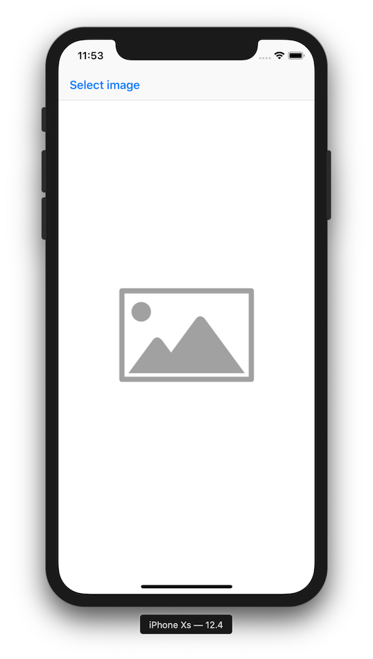
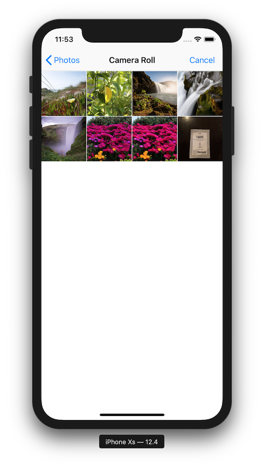
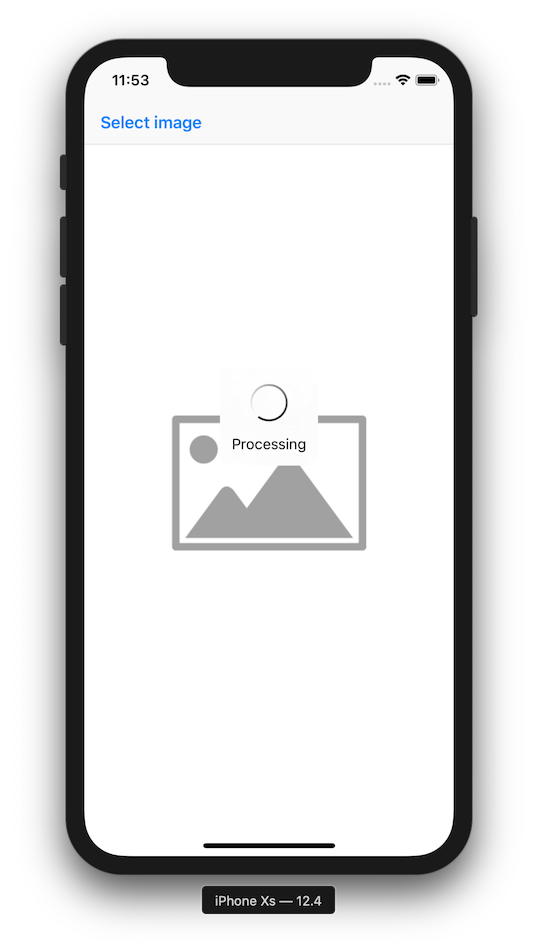
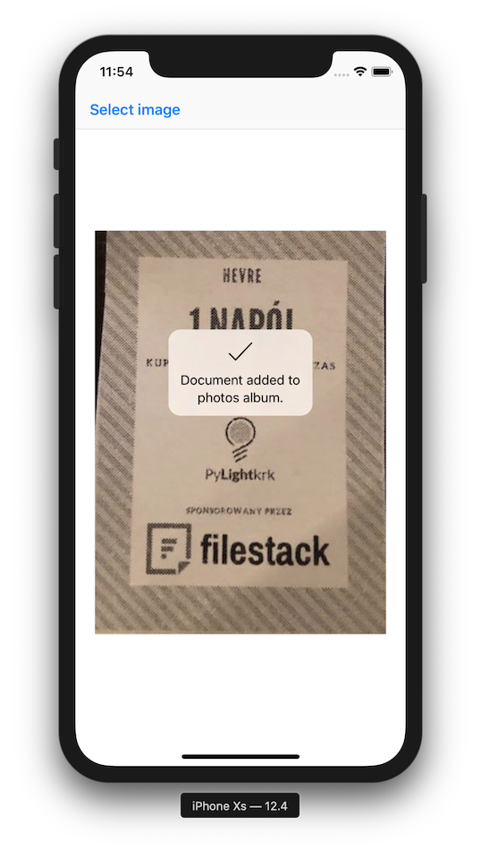
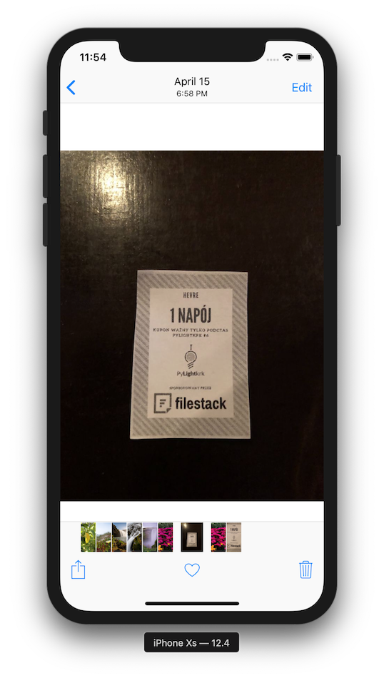
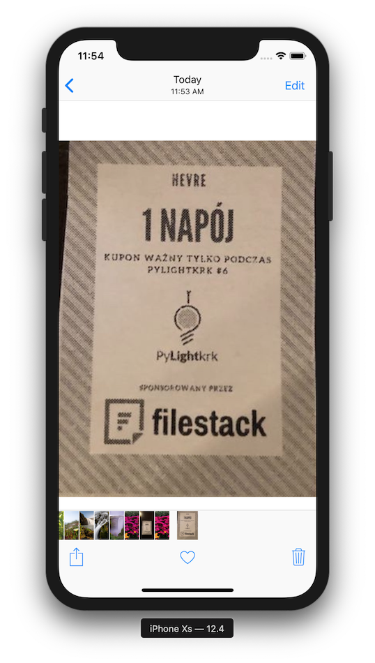

# Document Detection Demo

This demo crops an user picked image to a document using [FilestackSDK](http://github.com/filestack/filestack-swift)'s transformation API and adds it to the photos album.

## Requirements

* Xcode 10.3 or later
* iOS 11 or later
* CocoaPods

## Installing

`$ pod install`

## Setup

1. Open `DocDetectionDemo.xcworkspace` in Xcode.
2. Set `filestackAPIKey` and `filestackAppSecret` in `FilestackSetup.swift`.
3. Done.

## Launch

- Go to `Product` menu and click `Run` (or `⌘ + R`).

## Screenshots

||||
|---|---|---|
||||
||||
